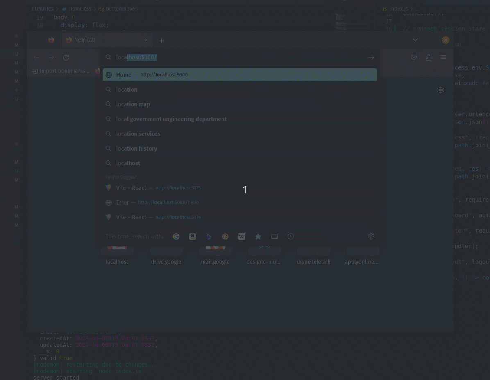
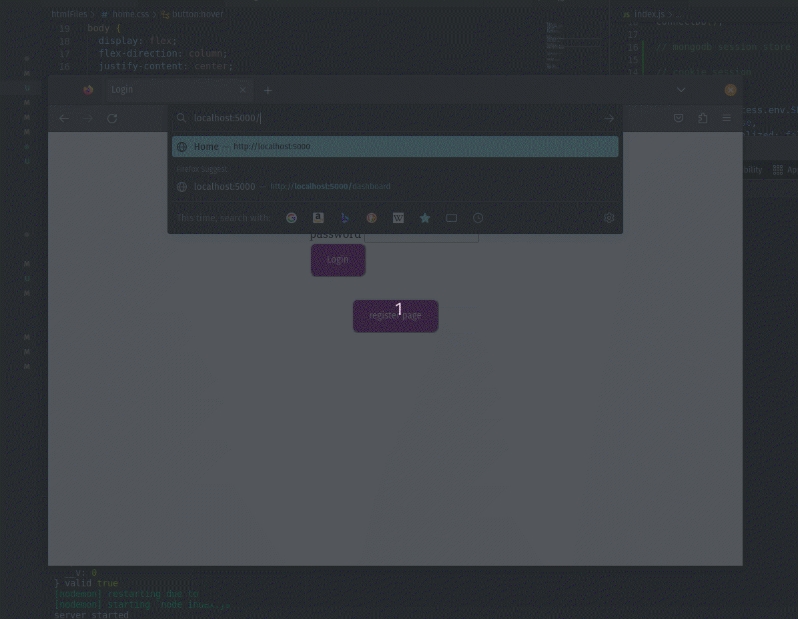

# Auth using session cookies

## Description:

 
I was learning about session cookies and user authentication. This project is made to try out how session cookies work and how to integrate them with express.js app.

This is a simple authentication app built using Express.js and MongoDB. The app allows users to register and login using unique email and username. After logging in, the user is assigned a session cookie and can access the private dashboard page.
 

## App Preview:

Here are two short videos demonstrating the app:

### Preview - 1:

 

### Preview - 2:

 

- Dashboard is private. Session cookies are used to authorize the user login.
- Once the user logged out session cookies are cleared.

 

## App Features:

- Home page with registration and login forms.
- Registration form with unique email and username validation.
- Password is hased to make them secure.
- Login form with session cookie assignment.
- Private dashboard page only accessible to registered users.
- User data (email, username, and password) stored in MongoDB

## Tech stack used

- Node.js
- Express.js
- MongoDb
- Mongoose
- HTML
- CSS
- bcrypt

## Run and test the app in your own.

- To run the app locally, clone the repo and run npm install to install dependencies. Then, start the app using npm start. The app will be available at http://localhost:3000.
